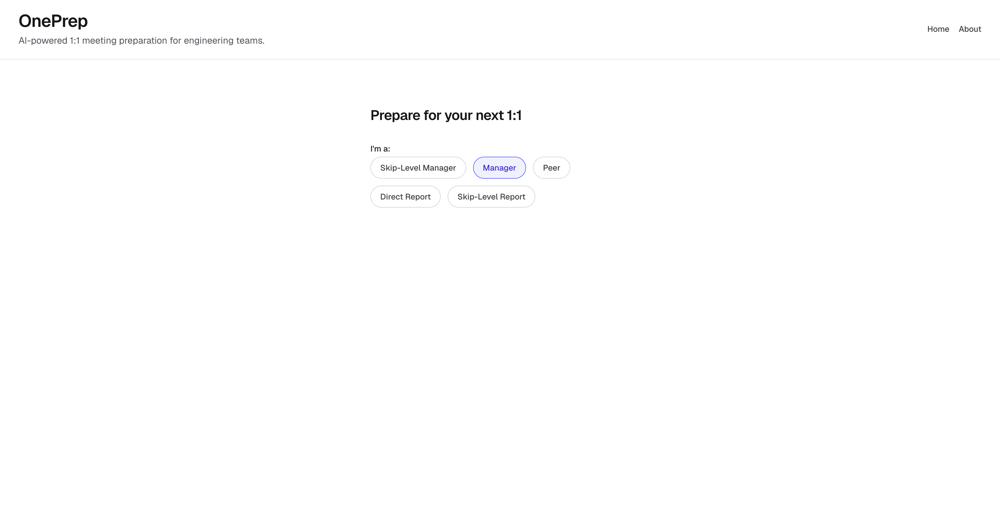
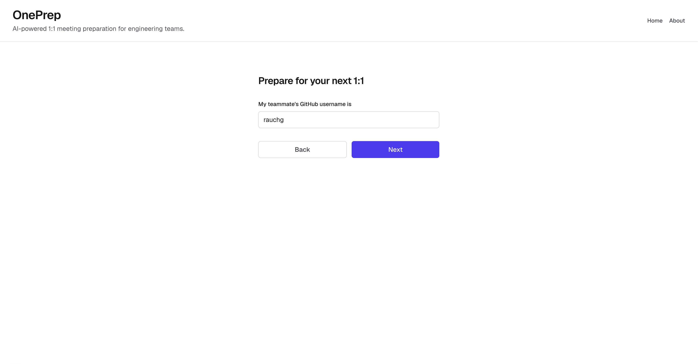
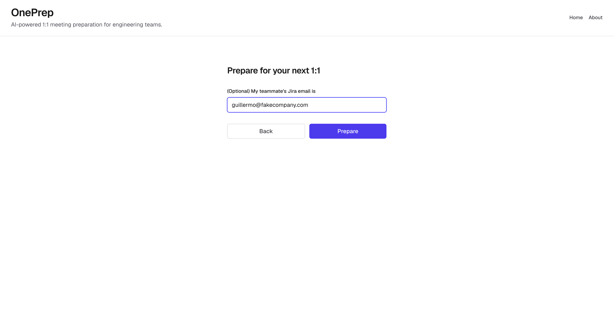
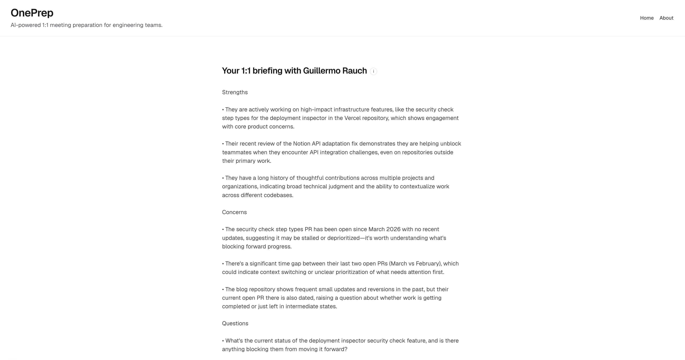

<p align="center">
  
</p>

# OnePrep

## AI-powered 1:1 meeting preparation for engineering teams.

Most 1:1 meetings start cold. You sit down with a teammate and spend the first ten minutes trying to remember what they have been working on, what shipped, and what got stuck. OnePrep removes that scramble. It gathers a teammate's recent work and turns it into a focused briefing you can read in a minute before the meeting starts.

It works by pulling signal from the tools where work actually happens. From GitHub it reads the pull requests they have opened and the pull requests they have reviewed for others, so you can see both what they are shipping and the collaboration that often goes unnoticed. From Jira it reads the issues assigned to them in the current sprint, so you can see what is in flight and what might be blocked. Jira is optional, so a briefing still works with GitHub on its own.

The briefing itself is short and structured. It reads the gathered activity and writes a small set of strengths worth recognizing, concerns worth watching, and questions worth asking. Every point is grounded in real activity rather than generic advice, and the framing adapts to your relationship with the teammate, whether you are their manager, a peer, a direct report, or a skip level.

The goal is simple. Walk into every 1:1 already knowing the shape of the conversation, so the time you spend together goes to the things that matter.

## Screenshots

The three-step form:

<table>
  <tr>
    <td></td>
    <td></td>
    <td></td>
  </tr>
  <tr>
    <td align="center">1. Pick your role</td>
    <td align="center">2. GitHub username</td>
    <td align="center">3. Jira email (optional)</td>
  </tr>
</table>

A generated briefing:



## Prerequisites

- Node.js 20.9 or newer
- pnpm
- An Anthropic API key (required). A GitHub token and Jira credentials are optional, and each one unlocks its data source.

## Setup

Install dependencies and create your local environment file:

```bash
pnpm install
cp .env.example .env.local
```

Open `.env.local` and set `ANTHROPIC_API_KEY`. The GitHub and Jira values are optional. See the comments in `.env.example` for what each one does and where to create the tokens.

## Running

Start the development server:

```bash
pnpm dev
```

Then open http://localhost:3000.

To run a production build locally:

```bash
pnpm build
pnpm start
```

## Scripts

| Command | What it does |
| --- | --- |
| `pnpm dev` | Start the development server |
| `pnpm build` | Create a production build |
| `pnpm start` | Serve the production build |
| `pnpm lint` | Run ESLint |
| `pnpm test` | Run unit tests |
